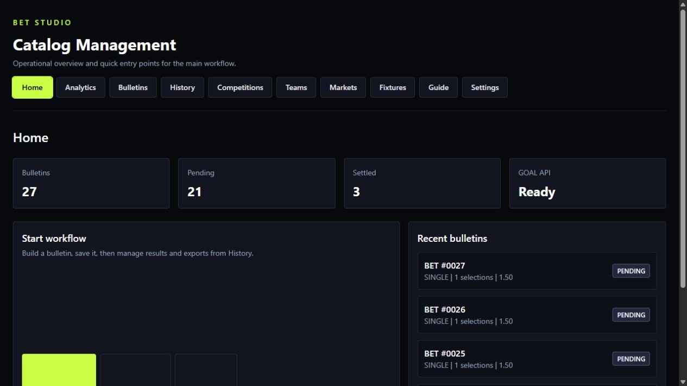
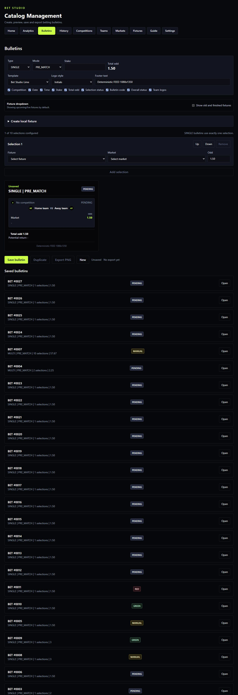
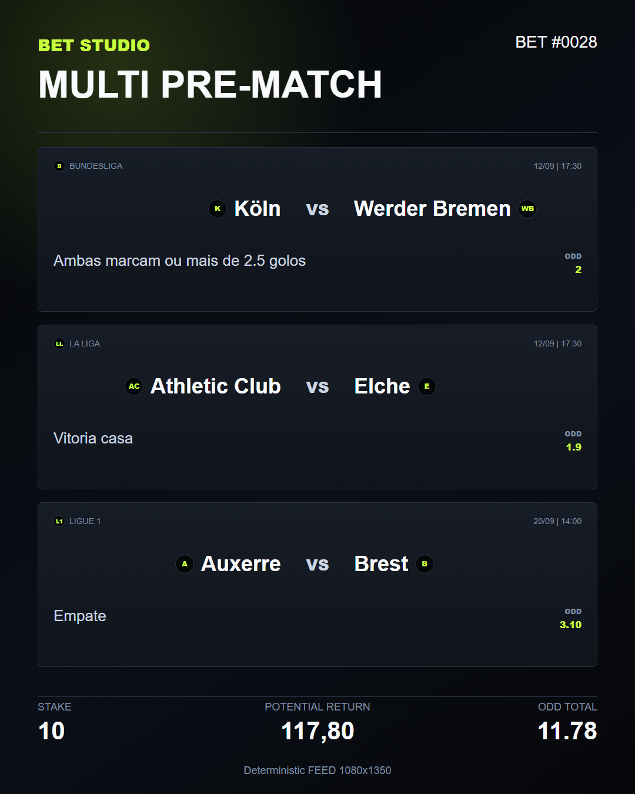
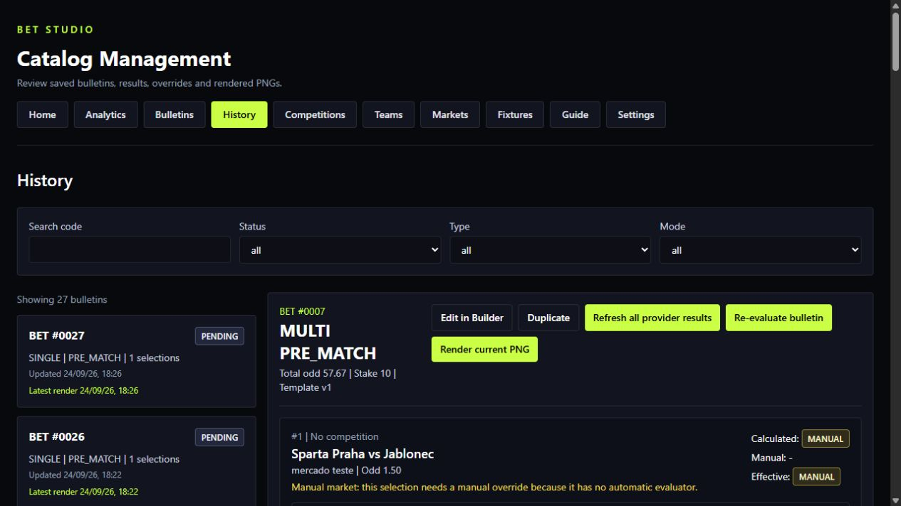
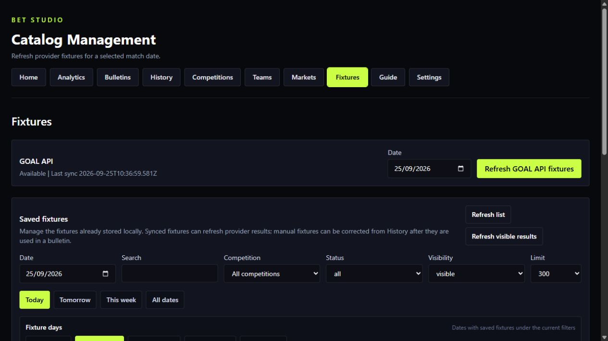
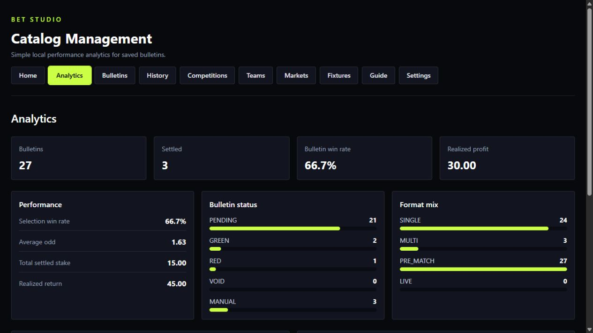

# Bet Studio

Local-first platform for creating, evaluating and rendering professional
football betting bulletins.

`TypeScript` · `React` · `Fastify` · `SQLite` · `Drizzle` · `Vitest` ·
`Playwright` · `Tailwind CSS` · `GitHub Actions`

> Portfolio notice: this repository is public for review and recruitment
> purposes only. It is not open source. See [LICENSE.md](LICENSE.md).

Bet Studio combines a structured bulletin builder, football data
synchronization, deterministic market evaluation, renderable template variants,
local SQLite persistence and a history workflow for results and settlement.

## Demo Preview

Screenshots below use local demo data.



### Builder And Export





### History, Fixtures And Analytics







## Product Workflow

```text
Catalog data
  -> Fixtures
  -> Bulletin Builder
  -> PNG Rendering
  -> History
  -> Result refresh / Manual settlement
  -> Analytics
```

Core workflows remain usable offline and manually. External football providers
are optional helpers for competitions, teams, fixtures, results and artwork.

## Highlights

- Local-first product with SQLite persistence and no required cloud services.
- `SINGLE` and `MULTI` bulletin builder with up to 10 selections.
- Manual fixtures plus optional provider-synced fixtures.
- Saved fixture management with date filters, competition/status filters,
  archive/restore actions and bulk refresh for visible synced results.
- Deterministic market settlement for supported market families.
- Manual result entry and manual settlement overrides when provider data is
  incomplete or unsafe to evaluate automatically.
- History view with saved bulletins, selection results, render records and
  audit-style settlement events.
- Deterministic FEED PNG export at `1080 x 1350`.
- Multiple FEED themes, configurable footer text and optional team initials or
  official cached team logos.
- Historical snapshots so saved bulletins and renders do not silently change
  when current catalog data changes later.
- Analytics for bulletin outcomes, selection breakdowns, settled stake,
  realized return, realized profit, top markets and top competitions.

## Engineering Highlights

- Layered architecture with clear dependency direction:

```text
Presentation
    ↓
Application
    ↓
Domain
    ↑
Infrastructure
```

- Domain rules are framework-independent.
- Provider responses are normalized and treated as untrusted input.
- External API credentials stay server-side.
- Rendering is deterministic and based on structured data, not generated images.
- Market settlement uses market codes and validated parameters, never natural
  language guessing.
- Automated tests avoid live football API calls.
- CI runs formatting, linting, typechecking, tests and production build.

## Tech Stack

- TypeScript
- React
- Vite
- Tailwind CSS
- Node.js 22
- Fastify
- SQLite
- Drizzle ORM
- Zod
- Vitest
- Playwright Chromium
- ESLint
- Prettier
- GitHub Actions

## Getting Started

### Requirements

- Node.js `>=22 <23`
- npm
- Playwright Chromium for PNG rendering and optional E2E tests

### Install

```bash
npm install
npx playwright install chromium
```

### Environment

Create a local `.env` from `.env.example`:

```bash
cp .env.example .env
```

On Windows PowerShell:

```powershell
Copy-Item .env.example .env
```

Available environment variables:

```text
NODE_ENV=development
API_HOST=127.0.0.1
API_PORT=3000
BET_STUDIO_DB_PATH=./data/bet-studio.db
GOAL_API_KEY=
GOAL_API_BASE_URL=https://api.goal-api.com/v1
GOAL_API_TIMEOUT_MS=10000
API_FOOTBALL_API_KEY=
API_FOOTBALL_BASE_URL=https://v3.football.api-sports.io
API_FOOTBALL_TIMEOUT_MS=10000
API_FOOTBALL_REQUEST_INTERVAL_MS=6500
API_FOOTBALL_SEASON=2024
```

Provider keys are optional. If they are empty, local workflows still work and
provider sync actions fail gracefully.

Never commit `.env` or real API keys.

### Database

Run migrations before starting the app:

```bash
npm run db:migrate
```

The default local database path is `./data/bet-studio.db`.

### Run

```bash
npm run dev
```

The API runs on `127.0.0.1:3000` by default. The Vite web app runs on the port
selected by Vite, normally `5173`.

## Football Data Providers

GOAL API integration is optional and server-side only. It can refresh selected
competitions, teams, fixtures and fixture results. Responses are validated and
normalized before persistence.

API-Football integration is optional and used for official team artwork. Logos
are cached locally and rendering falls back to deterministic initials whenever
an official logo is missing.

Bet Studio does not require provider access for local competitions, teams,
fixtures, bulletins, settlement, history, analytics or rendering.

See [docs/api-integration.md](docs/api-integration.md).

## Market Engine

Automatic settlement is deterministic and based on market codes plus validated
parameters.

Implemented evaluator families:

- `MATCH_RESULT`
- `TOTAL_GOALS`
- `DOUBLE_CHANCE`
- `BTTS`
- `TOTAL_CORNERS`
- `COMPOSITE`

Unsupported or unsafe automatic settlement resolves to `MANUAL`.

See [docs/market-engine.md](docs/market-engine.md).

## Rendering

The current production export format is:

```text
FEED
1080 x 1350
PNG
```

Rendering uses structured saved bulletin data, frozen snapshots, versioned
templates and local assets. Playwright Chromium renders the final PNG.

The Builder exposes deterministic FEED themes: `LIME`, `ELECTRIC`, `MONO`,
`CHAMPIONS`, `EUROPA` and `CONFERENCE`. Team identity can render as initials or
official cached logos with initials fallback. Footer text is configurable per
bulletin for channels, social links or service branding.

See [docs/rendering-engine.md](docs/rendering-engine.md).

## Testing

Common quality commands:

```bash
npm run format:check
npm run lint
npm run typecheck
npm run test
npm run build
```

Run the local CI-equivalent gate:

```bash
npm run verify
```

Optional E2E tests:

```bash
npm run test:e2e
```

Ordinary automated tests do not call real football APIs.

## Project Structure

```text
docs/                 Product, architecture, data, market, provider and rendering docs
drizzle/              Database migrations
src/domain            Framework-independent domain rules
src/application       Use cases and service coordination
src/infrastructure    Database, repositories, providers, assets and rendering adapters
src/presentation      Fastify API and React web app
```

## Documentation

- [docs/product-spec.md](docs/product-spec.md)
- [docs/architecture.md](docs/architecture.md)
- [docs/data-model.md](docs/data-model.md)
- [docs/market-engine.md](docs/market-engine.md)
- [docs/rendering-engine.md](docs/rendering-engine.md)
- [docs/api-integration.md](docs/api-integration.md)
- [AGENTS.md](AGENTS.md)

## Security And Data

Bet Studio is local-first. Application data is stored locally, API credentials
stay server-side, `.env` is ignored by git and generated exports/database files
are not committed by default.

API errors use a stable envelope:

```json
{
  "error": {
    "code": "VALIDATION_ERROR",
    "message": "Human-readable message"
  }
}
```

## Development Note

AI-assisted coding tools were used during development for implementation
support, refactoring and documentation review. Product direction, architecture
decisions, validation and final code ownership remain with the author.

## Trademarks And Third-Party Assets

Team names, competition names, logos and related marks may belong to their
respective owners. Bet Studio does not claim ownership of third-party trademarks
or provider-supplied artwork.

Official team logos are treated as optional locally cached visual references for
development and demo workflows. They should be cleared, replaced or separately
licensed before any commercial, public production or client use.

## Future Scope

- Story `1080 x 1920` rendering.
- Additional football providers.
- Additional market families.
- Richer provider statistics when available.
- More template families.

## License

This project is proprietary and published for portfolio review only.

Copyright (c) 2026 David. All rights reserved.

No permission is granted to copy, modify, redistribute, sublicense, sell, host,
deploy or use this software for personal, commercial or production purposes
without prior written permission. See [LICENSE.md](LICENSE.md).

## Disclaimer

Bet Studio is a content and workflow tool. It does not provide betting advice,
predictions or guaranteed outcomes.
